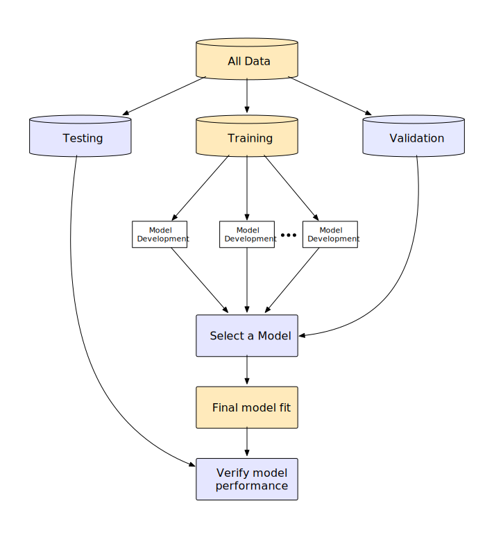
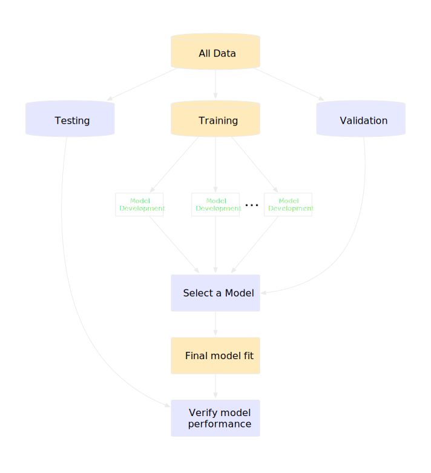
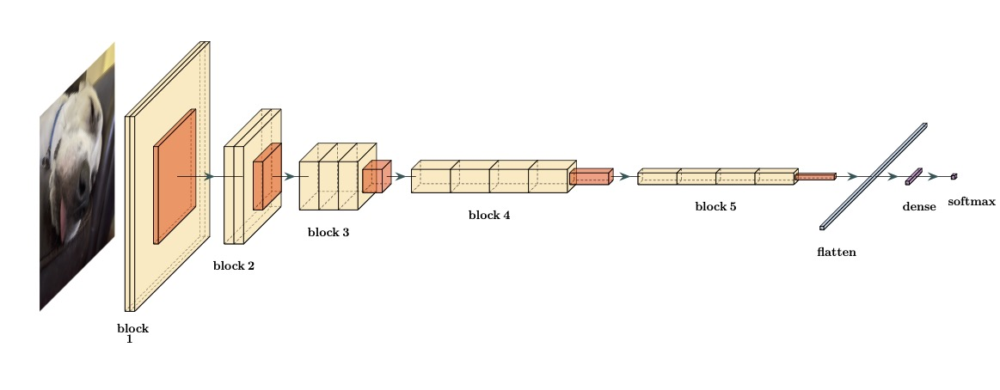
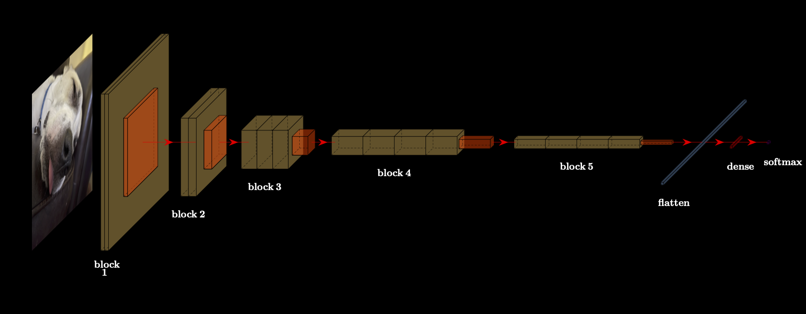

---
knitr:
  opts_chunk:
    cache.path: "../_cache/introduction/"
---

# Introduction {#sec-introduction}

```{r}
#| label: introduction-setup
#| include: false
source("../R/_common.R")

# ------------------------------------------------------------------------------

library(stringr)
library(tidymodels)
library(textrecipes) # also requires stopwords package
library(gt)
library(gtExtras)

# ------------------------------------------------------------------------------
# Set options

tidymodels_prefer()
theme_set(theme_transparent())
set_options()
```

Machine learning (ML) models are mathematical equations that take inputs, called _predictors_, and try to estimate some future output value. The output, often called an _outcome_ or _target_, can be numbers, categories, or other types of values. 

For example, in the next chapter, we try to predict how long it takes to deliver food ordered from a restaurant. The outcome is the time from the initial order (in minutes). There are multiple predictors, including: the distance from the restaurant to the delivery location, the date/time of the order, and which items were included in the order. These data are _tabular_; they can be arranged in a table-like way (such as a spreadsheet or database table) where variables are arranged in columns and individual data points (i.e., instances of food orders) in rows, as shown in @tbl-deliveries^[Non-tabular data are later in this chapter.].  

```{r}
#| label: simple-deliveries

source("../R/setup_deliveries.R")

set.seed(28)
delivery_tbl <-
  delivery_train %>%
  mutate(
    group_1 = ntile(time_to_delivery, 15),
    group_2 = item_01 > 1
    ) %>% 
  group_by(group_1, group_2) %>% 
  sample_n(1) %>% 
  ungroup() %>% 
  slice(1:4, 12:15) %>% 
  sample_n(8) %>%
  select(-starts_with("group")) %>%
  select(time_to_delivery:item_02, item_27) %>% 
  setNames(c("Time to Delivery", "Hour of Order", "Day of Order", "Distance", 
             paste("   ", c(1, 2, 27), "   "))) %>%
  mutate(
    blank = "  ...  ",
    `Time to Delivery` = round(`Time to Delivery`, 2),
    `Hour of Order` = round(`Hour of Order`, 1),
    Distance = round(Distance, 2)
    ) %>%
  relocate(blank, .after = "    2    ")

lm_fit <- lm(log(time_to_delivery) ~ distance, data = delivery_train)
eq_coef <- format(coef(lm_fit), digits = 2)
```

Note that the predictor values are almost always known. For future data, the outcome is not; it is a machine learning model's job to predict unknown outcome values. 

TODO: In @fig-delivery-hist, we get a "(a)" between the image and the caption.


::: {#fig-delivery-hist}

::: {.figure-content}

```{r}
#| label: fig-delivery-hist
#| renderings: [light, dark]
#| fig-width: 9
#| fig-height: 4.25
#| fig-align: "center"
#| out-width: "80%"

theme_set(theme_transparent())

light_delivery_hist <- 
  deliveries %>% 
  ggplot(aes(x = time_to_delivery)) +
  geom_histogram(bins = 30, col = "white") +
  geom_rug(alpha = 1 / 4) +
  labs(x = "Time Until Delivery (min)", title = "(a)")

light_delivery_log_hist <- 
  deliveries %>% 
  ggplot(aes(x = time_to_delivery)) +
  geom_histogram(bins = 30, col = "white") +
  geom_rug(alpha = 1 / 4) +
  labs(x = "Time Until Delivery (min)", title = "(b)") +
  scale_x_log10(breaks = log_2_breaks, labels = log_2_labs)

dark_delivery_hist <- 
  deliveries %>% 
  ggplot(aes(x = time_to_delivery)) +
  geom_histogram(bins = 30, col = "#CCDEEC") +
  geom_rug(alpha = 1 / 4, col = "#CCDEEC") +
  labs(x = "Time Until Delivery (min)", title = "(a)") +
  dk_thm

dark_delivery_log_hist <- 
  deliveries %>% 
  ggplot(aes(x = time_to_delivery)) +
  geom_histogram(bins = 30, col = "#CCDEEC") +
  geom_rug(alpha = 1 / 4, col = "#CCDEEC") +
  labs(x = "Time Until Delivery (min)", title = "(b)") +
  scale_x_log10(breaks = log_2_breaks, labels = log_2_labs) +
  dk_thm

both_light <- light_delivery_hist + light_delivery_log_hist

both_dark <- dark_delivery_hist + dark_delivery_log_hist

both_light

both_dark
```

:::

Histrograms of the training set outcome data with and without a transformation.

:::

TODO The next figure, , is included images and another "(a)" and produces a warning in the terminal:

::: {#fig-model-building-process}

::: {.figure-content}

```{r}
#| label: fig-model-building-process
#| echo: false
#| renderings: [light, dark]
#| out-width: 60%




```

:::

A general high level view of the process of creating a predictive model. The diagram reflects which steps use the test set, validation set, or the entire training set. 
:::


TODO We should think about about doing more than a warning when a traditional chunk is used in a book with `renderings: [light, dark]` and without fenced chunks. 

Here's an example that _appears_ to work but when you switch to dark mode, the figure number changes. 


```{r}
#| label: fig-vgg16
#| echo: false
#| renderings: [light, dark]
#| out-width: "100%"
#| fig-align: "center"
#| fig-cap: A simplified version of the convolutional neural network deep learning model proposed by @simonyan2014very. This version only includes a single dense layer (instead of four).




```


## A Table

TODO A few issues with @tbl-cells below: 

- Another "(a)"
- Both tables show up
- `gt_theme_dark()` capitalizes columns ¯\\_(ツ)_/¯
- Also, why are figure captions left aligned but tables are right aligned. 

::: {#tbl-cells}

:::: {.columns}

::: {.column width="15%"}

:::

::: {.column width="70%"}

```{r}
#| label: tbl-cells
#| renderings: [light, dark]

cell_data <- 
tibble::tribble(
  ~ID,  ~n_ecc,  ~c_ecc, ~blank_1, ~n_area, ~c_area, ~blank_2, ~n_mean, ~c_mean,
  17L, 0.49375, 0.83583,      " ",   3352L,  11699L,      " ", 0.27438, 0.15497,
  18L,  0.7077, 0.54952,      " ",   1777L,   4980L,      " ", 0.27805, 0.20983,
  21L, 0.49524, 0.80247,      " ",   1274L,   3081L,      " ", 0.32611, 0.21763,
  22L, 0.80864, 0.97505,      " ",   1169L,   3933L,      " ", 0.58297, 0.22871
  ) %>% 
  rename_with(~ gsub("n_", "Nucleus_", .x), starts_with("n_")) %>% 
  rename_with(~ gsub("c_", "Cell_", .x), starts_with("c_"))

cell_tbl <- 
  cell_data %>% 
  gt() %>% 
  tab_options(table.background.color = light_bg) %>% 
  fmt_integer(columns = c(contains("area"))) %>% 
  fmt_number(columns = c(contains("ecc"), contains("mean")), n_sigfig = 3) %>%   
  cols_label(blank_1 = " ", blank_2 = " ") %>% 
  cols_label_with(fn = function(x) gsub("(_area)|(_mean)|(_ecc)", "", x)) %>% 
  tab_spanner(label = "Area", columns = c(ends_with("area"))) %>% 
  tab_spanner(label = "Intensity", columns = c(ends_with("mean"))) %>% 
  tab_spanner(label = "Eccentricity", columns = c(ends_with("ecc")))

cell_tbl

cell_tbl |> gt_theme_dark()
```

:::

::: {.column width="15%"}

:::

::::

Cells, such as those found in a previous figure, translated into a tabular format using three features for the nuclear and non-nuclear regions of the segmented cells.

:::


I just put the next table to see if we get the reference number changing when you go between light/dark (it did not for me). 

```{r}
#| label: tbl-deliveries
#| renderings: [light, dark]
#| tbl-cap: "A random selection of several rows from a tabular data set on food delivery times."

example_dbl <- 
  delivery_tbl %>% 
  gt() %>% 
  tab_options(table.background.color = light_bg) %>% 
  cols_label_with(fn = function(x) ifelse(x == "blank", "...", x)) %>% 
  tab_spanner(label = "Item Counts", columns = c((ncol(delivery_tbl)-3):ncol(delivery_tbl))) %>% 
  tab_style(
    style = cell_borders(sides = c("bottom"),  weight = px(1.8)),
    locations = cells_body(rows = nrow(delivery_tbl))
  ) %>% 
  tab_style(
    style = cell_borders(sides = c("top", "bottom"),  weight = px(1.8)),
    locations = cells_column_labels()
  ) %>% 
  cols_width(c(starts_with(" ")) ~ px(100))

example_dbl

example_dbl |> gt_theme_dark()
```


## Chapter References {.unnumbered}
